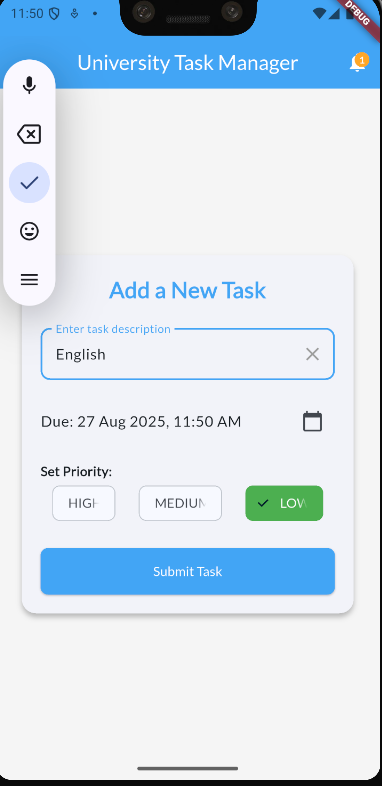
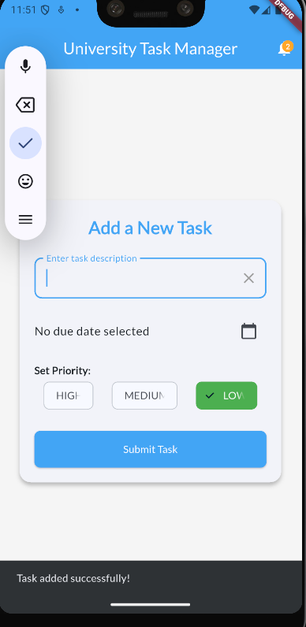
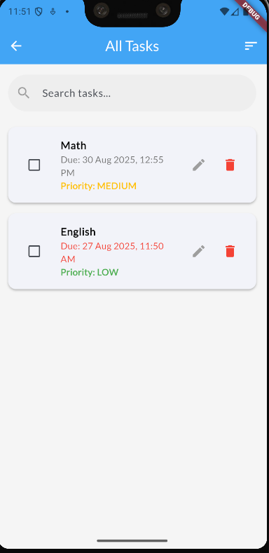
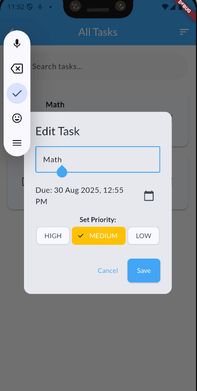
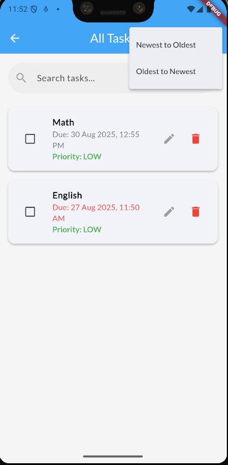

# 📚 Save Homework

**Save Homework** is a Flutter application designed to help students keep track of their homework submissions, deadlines, and reminders — all in a simple, clean UI.

---

## 🛠️ Features

- 📥 **Add Homework Submissions**  
- 📋 **View Homework List**  
- ⏰ **Set Notifications and Reminders**  
- 🧠 **Persistent Data with Shared Preferences**  
- 🌍 **Timezone-aware Scheduling**  
- 🎨 **Custom Fonts with Google Fonts**

---

## 📁 Project Structure

```plaintext
lib/
├── main.dart
├── models/
│   └── submission.dart                 # Data model for homework submissions
├── providers/
│   └── submission_provider.dart        # State management with Provider
├── screens/
│   ├── input_page.dart                 # UI for adding homework
│   └── list_page.dart                  # UI to display homework list
└── widgets/
    └── notification_badge.dart         # UI component for showing notification badges
```

---

## 🧾 Dependencies
```plaintext

dependencies:
  flutter:
    sdk: flutter
  provider: ^6.1.5 
  intl: ^0.18.1
  shared_preferences: ^2.2.0
  google_fonts: ^5.1.0
  flutter_local_notifications: ^16.3.3
  timezone: ^0.9.2
```
---


## Screenshots

| Input Page              | List Page               | Notification Badge    |
| ----------------------- | ----------------------- | --------------------- |
|      |     |  |
|  |  |                       |


## 👨‍💻 Author
Created by Chhery Chorn


---

### 📝 Notes:

- Make sure your images (`image.png`, `image-1.png`, etc.) are placed in the **same folder as your `README.md`** or update the paths accordingly (e.g., `image.png`).
- `ChornChhery` in the GitHub clone URL with your actual GitHub username.
- **Chhery Chorn** with your actual name.

Once saved and pushed to your GitHub repo, GitHub will automatically render the markdown to look just like what I showed earlier.

Let me know if you’d like it styled even more!
